# Transfer learning for COVID-19 detection
SARS-COV-2 constitutes a novel virus with a relatively high infection rate [2].
As such, early and effective detection is needed in order to track and impede the
spread of the pandemic. We propose a Deep Learning approach for detecting
COVID-19 based on X-ray images. Aside from detection, our network provides
insight about the affected area, the core locations of infection and how similar diseases are when represented by networks. Our findings illustrate promising results
both in localisation as well as AUC, reaching a ROC curve performance of 0.88 on
the COVID-19 X-ray Dataset. Our report also analyses the importance of Transfer
Learning, Model Architecture and Data Pre-processing.

Our  model  builds  upon  well  established  architectures  for  robustness  and  efficacy.   It  consists  of a core deep Convolutional Neural Network which is augmented with a fully connected layer forclassification. Mainly two types of architetures were explored: DenseNet121 and ResNet50. 

Our Deep Neural Network approach produced noteworthy results, showcasing great potential androbustness in diagnostic tasks.  Its latent representation was able to properly separate the classesand created distinct clusters, by producing a new vector space that can model sample characteristicsmore accurately.  Furthermore, we showed that the network can be utilized for other tasks, not justdiscriminative,  by  applying  SOMs  to  uncover  class  relationships  and  using  heatmaps  (CAM)  tohighlight the affected region.  Using the latter, the network’s decision can be investigated to avoidoverfitting due to data set particularities (e.g. small and unbalanced data sets). Our experiments showthat an effective way of avoiding this is using pre-trained models, as they initialize the networks inbetter regions of the learning space, avoiding such undesirable overfit solutions.

## Results on ChestX14 dataset
### Roc Curves
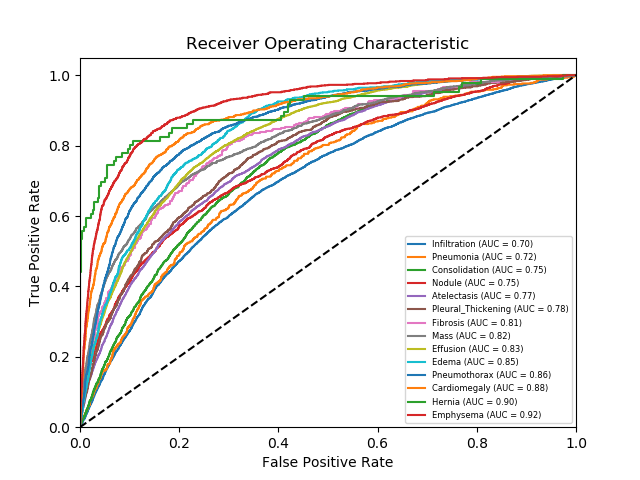

### CAM examples

  

    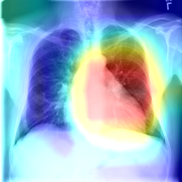
  

  

    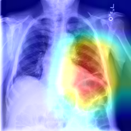
  

  

    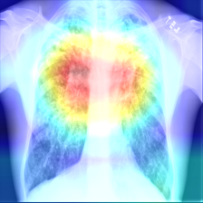
  

### Comparison Relative Results

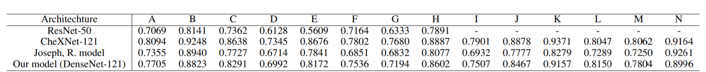

## Results on COVID-19 Dataset
### Result Table

### CAM examples

  

    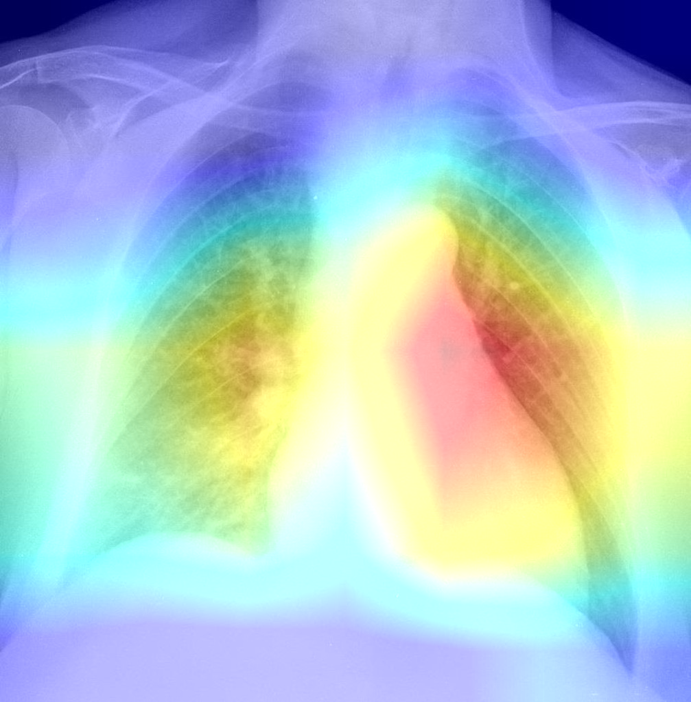
  

  

    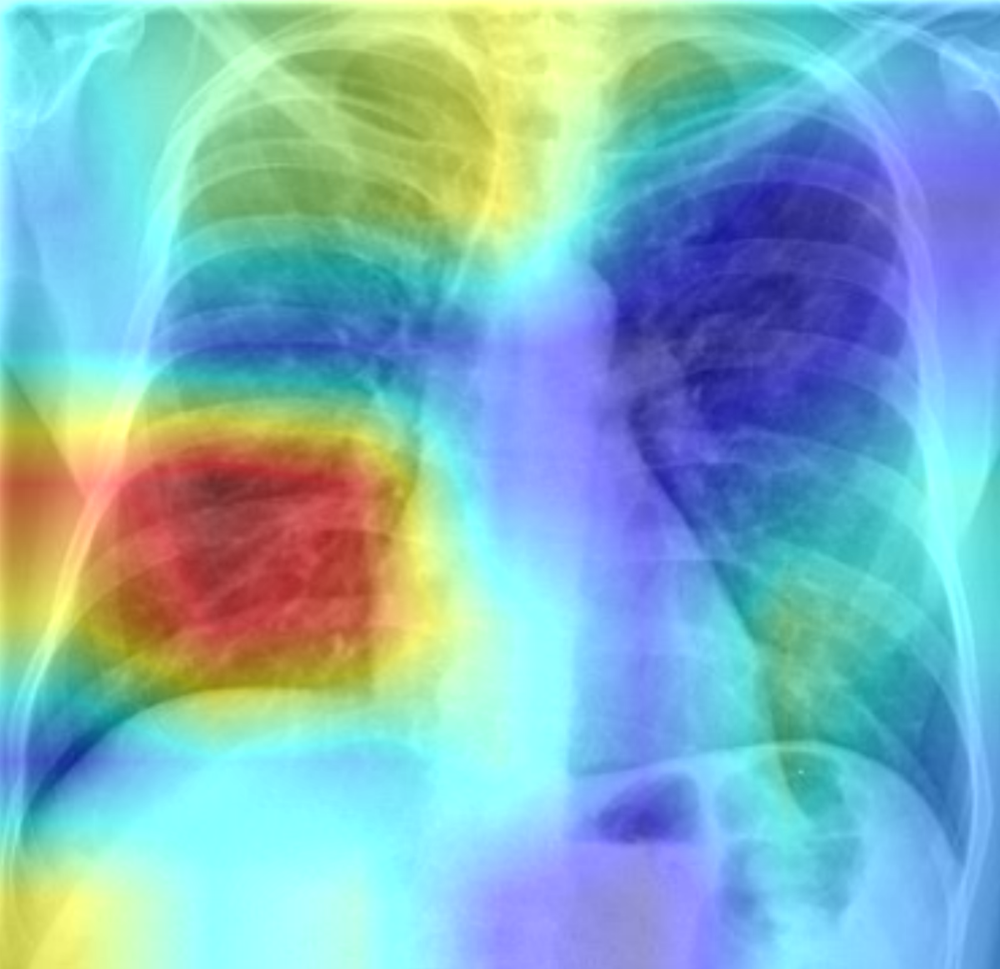
  

  

    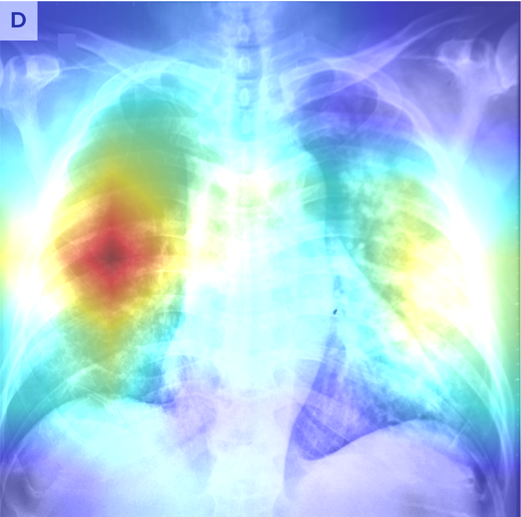
  

## 15 Classification problem (COVID + chestXray14)

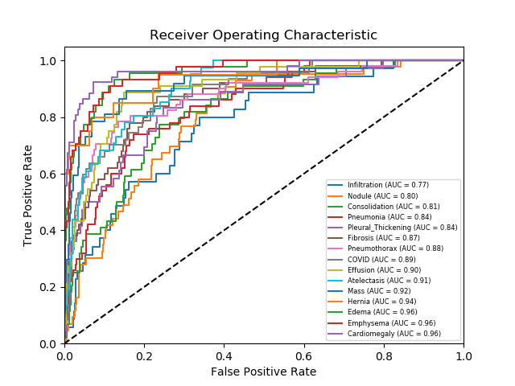

## Data Visualization (SOMs and tSNE)

  

    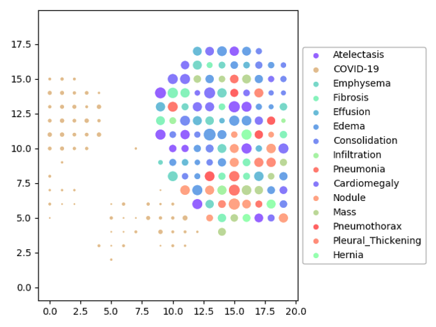
  

  

    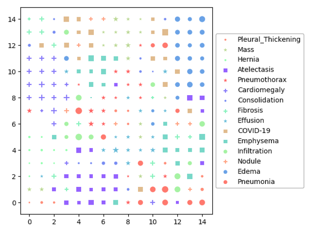
  

  

    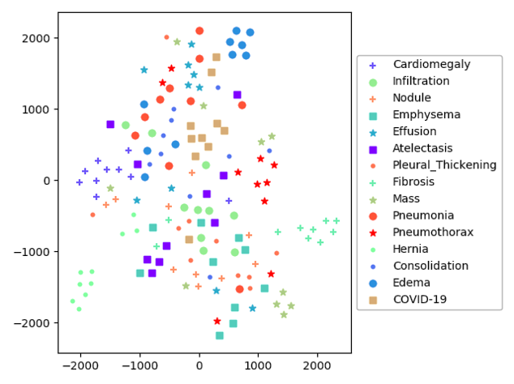
  

